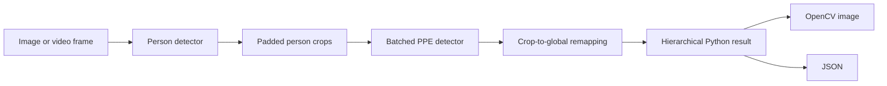

# two-stage-ppe

An open-source framework for detecting people first, then detecting PPE inside person crops while preserving ownership and full-image coordinates.

> **Status:** v0.5.0. The initial backend is Ultralytics YOLO. Checkpoints, datasets, and sample predictions are intentionally not distributed.

## Architecture



## Why two stages?

PPE can occupy very few pixels in a full scene. Cropping each detected person gives the child detector a larger effective view of small equipment and provides a natural `person -> PPE` relationship. V0.2 sends the crops from each source image to the PPE model as an ordered batch, reducing backend invocations in multi-person scenes while retaining explicit ownership.

## Installation

Python 3.10 or newer is required.

```bash
git clone https://github.com/10ishk/two-stage-ppe.git
cd two-stage-ppe
python -m pip install -e ".[yolo]"
```

Install optional worker tracking support with `python -m pip install -e ".[yolo,tracking]"`.
Install training support with `python -m pip install -e ".[training]"`.

Bring compatible Ultralytics checkpoints: one with a person-like class and one trained for the PPE classes relevant to your application. No checkpoints are bundled.

## Quick start

```python
from two_stage_ppe import PPEPipeline

pipeline = PPEPipeline(
    person_model="person.pt",
    ppe_model="ppe.pt",
    person_conf=0.30,
    ppe_conf=0.30,
    crop_padding=0.05,
    ppe_batch_size=8,
)

result = pipeline.predict("image.jpg")
result.save_image("output.jpg")
result.save_json("output.json")
```

The models are loaded once when `PPEPipeline` is created. Reuse a pipeline for multiple images. `ppe_batch_size=None` (the default) batches all valid person crops from one source image, `1` is effectively sequential PPE inference, and a positive integer processes chunks of at most that size.

## Python API

`PPEPipeline.predict(path)` returns an `ImageResult`. Every `PersonResult` owns its list of PPE `Detection` objects. All public boxes use full-image `[x1, y1, x2, y2]` pixel coordinates.

For directories:

```python
results = pipeline.process("images/", "results/", save_images=True, save_json=True)
```

Input directory traversal is non-recursive and supports JPG, JPEG, PNG, BMP, TIFF, and WebP.

## CLI

```bash
two-stage-ppe detect \
  --input images/ \
  --output results/ \
  --person-model person.pt \
  --ppe-model ppe.pt \
  --ppe-batch-size 8 \
  --save-json
```

The same interface is available through `python -m two_stage_ppe detect ...`.

Useful options include `--person-conf`, `--ppe-conf`, `--iou`, `--crop-padding`, `--ppe-batch-size`, `--device`, `--person-class`, `--save-json`, and `--no-images`. `--person-class` accepts either a model class name or numeric class ID. PPE names always come from the supplied PPE checkpoint.

Larger PPE batches reduce model-call overhead but use more accelerator memory. Use a smaller `ppe_batch_size` or `--ppe-batch-size` on constrained GPUs. No automatic out-of-memory retry is performed.

## Video inference

Models remain loaded once, frames are processed incrementally, and PPE crops stay batched within each processed frame.

```bash
two-stage-ppe video \
  --input input.mp4 \
  --output output.mp4 \
  --person-model person.pt \
  --ppe-model ppe.pt \
  --ppe-batch-size 8 \
  --frame-stride 2 \
  --jsonl results.jsonl
```

```python
from two_stage_ppe import PPEPipeline

pipeline = PPEPipeline("person.pt", "ppe.pt", ppe_batch_size=8)
summary = pipeline.predict_video(
    "input.mp4",
    "output.mp4",
    save_json=True,
    frame_stride=2,
    start_frame=0,
    max_frames=100,
)
print(summary.to_dict())
```

`frame_stride=1` runs inference on every frame; `2` processes every second frame. Output video remains playable because all frames in the selected range are written: processed frames receive fresh annotations and skipped frames remain unannotated. Detections are never copied forward. `start_frame` uses the original zero-based frame index, while `max_frames` limits the number of processed frames.

JSONL output writes one object immediately after each processed frame, so long videos do not accumulate structured results in memory. A `frame_callback` can consume the same `FrameResult` stream in Python. Container and codec availability depends on the local OpenCV build.

Without optional tracking, person IDs are frame-local: person `0` in one frame is not guaranteed to represent the same real person as person `0` in another frame.

## Worker tracking

V0.4 can optionally track detected persons with ByteTrack. The existing `id` remains the frame-local result index; `track_id` is an additional persistent video identity while the tracker maintains association. PPE detections are not tracked independently—they remain frame-local observations attached to the corresponding tracked person.

```bash
two-stage-ppe video \
  --input input.mp4 \
  --output output.mp4 \
  --person-model person.pt \
  --ppe-model ppe.pt \
  --track \
  --jsonl tracked.jsonl
```

```python
pipeline = PPEPipeline("person.pt", "ppe.pt", ppe_batch_size=8)
summary = pipeline.predict_video(
    "input.mp4",
    output_path="output.mp4",
    save_json=True,
    tracking=True,
)
```

Tracked person labels render as `person #17 0.91`, while PPE labels remain unchanged. Tracked JSONL persons include both fields:

```json
{
  "id": 0,
  "track_id": 17,
  "bbox": [120.0, 80.0, 420.0, 690.0],
  "confidence": 0.94,
  "ppe": []
}
```

With `frame_stride > 1`, the tracker updates only on processed frames. Skipped frames stay unannotated, and stale tracks or PPE are never drawn onto them. Every normal `predict_video(..., tracking=True)` call creates fresh tracker state; advanced callers may instead pass an externally managed `PersonTracker` instance.

Tracking is motion/overlap-based association, not person re-identification. IDs can change after long occlusion, detector misses, crowded crossings, or tracker loss. Tracking does not implement PPE compliance rules, PPE history, or cross-frame PPE smoothing.

## Train a complete two-stage PPE system

The optional training layer audits Pascal VOC data, splits source images before creating crops, prepares parent and child datasets, trains and validates both Ultralytics models, and writes a reusable project manifest.

```bash
two-stage-ppe train \
  --dataset dataset/ \
  --output runs/my_project \
  --parent-class person \
  --child-classes helmet gloves boots vest \
  --person-model yolo11n.pt \
  --ppe-model yolo11n.pt
```

Use `--dry-run` to audit and resolve the plan without creating files or invoking a trainer. Use `--prepare-only` to stop after leakage-safe parent and child dataset generation. `--calibrate-thresholds` caches low-threshold predictions from the validation split only and stores the selected operating point; test data is never used for calibration.

```python
from two_stage_ppe import PPEPipeline, TrainingConfig, train_two_stage

result = train_two_stage(TrainingConfig(
    dataset="dataset/",
    output="runs/my_project",
    parent_class="person",
    child_classes=["helmet", "gloves", "boots", "vest"],
    person_model="yolo11n.pt",
    ppe_model="yolo11n.pt",
))

pipeline = PPEPipeline.from_project("runs/my_project/project.json")
```

## Resume interrupted training

Resume is explicit and operates at project-stage boundaries:

```bash
two-stage-ppe train \
  --dataset dataset/ \
  --output runs/my_project \
  --parent-class person \
  --child-classes helmet gloves boots vest \
  --resume
```

The planner verifies manifest fingerprints and expected artifacts before reuse. Add `--dry-run` to inspect its `reuse`/`run` plan without changing files, or `--restart-from ppe_train` to rerun PPE training and downstream stages deliberately. Resume does not continue within an interrupted Ultralytics epoch; an incomplete training stage starts again.

## PPE compliance policies

An optional policy layer reports detector-observed PPE requirements; it does **not** guarantee real-world compliance. One policy defines exact required PPE model class names for an inference run:

```bash
two-stage-ppe detect --input image.jpg --output output \
  --person-model person.pt --ppe-model ppe.pt \
  --policy examples/compliance_policy.yaml --save-json
```

```python
from two_stage_ppe import CompliancePolicy

policy = CompliancePolicy(name="site-default", required=["hard-hat", "vest", "boots"])
result = pipeline.predict("image.jpg", compliance_policy=policy)
```

Each person is marked `compliant`, `non_compliant` with required classes in `missing`, or `unknown` when the policy cannot be evaluated safely against the PPE model. Policies can also evaluate existing results independently. JSON/JSONL adds compliance only when a policy is active; tracked video evaluates each processed frame without history or smoothing. See [compliance documentation](docs/compliance.md).

## Export and share a trained project

Move a completed project between machines without datasets or training logs:

```bash
two-stage-ppe export --project runs/site/project.json --output site.tsppe.zip
two-stage-ppe verify site.tsppe.zip
two-stage-ppe import site.tsppe.zip --output projects/site
```

The bundle contains portable project metadata, both required weights, SHA256 inventory data, and an explicitly referenced policy when present. Imported projects load normally with `PPEPipeline.from_project("projects/site/project.json")`. Integrity verification detects corruption and unsafe archives before extraction; it is not a publisher-authenticity signature. See [bundle documentation](docs/bundles.md).

The generated project contains prepared data, organized best checkpoints, Ultralytics logs, validation metrics, a structured training summary, and `project.json`. If the PPE stage fails, the prepared data, completed person checkpoint, metadata, and failure context remain available. See [docs/training.md](docs/training.md) for the complete contract.

Training orchestration does not guarantee model quality. Results depend on label correctness, class coverage, source diversity, base checkpoints, hyperparameters, hardware, and available training time.

## JSON result

```json
{
  "image": "image.jpg",
  "width": 1280,
  "height": 720,
  "persons": [
    {
      "id": 0,
      "bbox": [120.0, 80.0, 420.0, 690.0],
      "confidence": 0.94,
      "ppe": [
        {
          "class_id": 0,
          "class_name": "helmet",
          "bbox": [205.0, 92.0, 286.0, 171.0],
          "confidence": 0.88
        }
      ]
    }
  ]
}
```

## Dataset preparation

The tools expect images in `SOURCE/images/` and Pascal VOC XML in `SOURCE/annotations/` (or `SOURCE/labels/`).

```bash
python tools/voc_to_yolo.py SOURCE/annotations OUTPUT/labels \
  --classes person helmet vest

python tools/prepare_dataset.py SOURCE OUTPUT \
  --parent-class person \
  --child-classes helmet vest gloves \
  --padding 0.05 \
  --ioa-threshold 0.50 \
  --seed 42
```

Preparation splits source images before generating crops, associates each child by maximum intersection-over-child-area, keeps negative parent crops, and writes crop-relative YOLO labels. This prevents crops from one source image leaking across train and validation splits.

## Evaluation and calibration

`tools/evaluate_cascade.py` performs one-to-one, class-aware IoU matching against original full-image ground truth and reports TP, FP, FN, precision, recall, and F1 for both stages. Child predictions must already be globally remapped, as emitted by this package.

```bash
python tools/evaluate_cascade.py --ground-truth validation_gt.json --predictions predictions.json --iou 0.50
```

`tools/calibrate_thresholds.py` evaluates a confidence grid from cached, unfiltered validation predictions. It does not rerun models and does not label P/R/F1 as mAP.

## Project structure

```text
src/two_stage_ppe/   Public package, pipeline, results, rendering
tools/               Dataset conversion, preparation, evaluation, calibration
examples/            Image, directory, and video usage examples
tests/               Weight-free unit and synthetic integration tests
.github/             CI and collaboration templates
```

## Limitations

- Ultralytics YOLO is the only inference and training backend in v0.5.0.
- PPE crops are batched independently for each image or processed video frame.
- Worker tracking is optional and does not provide biometric re-identification or guaranteed identity persistence.
- Cross-person duplicate suppression is not performed.
- Accuracy and latency depend on user-provided checkpoints, data, hardware, thresholds, and scene density.
- Epoch-level training resume, policy history/smoothing, alerts, zones, hyperparameter search, live streams, deployment exports, and web interfaces are outside the v0.7.0 scope.

## Roadmap

- Optional release artifact builds (wheel and source distribution)
- Multiple-policy and zone-aware compliance routing
- Optional cross-person duplicate analysis
- Video and tracking support
- Export/runtime adapters after the core API stabilizes

## Contributing

Read [CONTRIBUTING.md](CONTRIBUTING.md) before opening a pull request. Bug reports and focused feature proposals are welcome.

## License

Licensed under the Apache License 2.0. See [LICENSE](LICENSE). This license covers the source code only; users are responsible for the terms governing their datasets and checkpoints.
