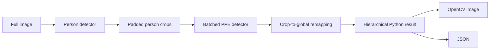

# two-stage-ppe

An open-source framework for detecting people first, then detecting PPE inside person crops while preserving ownership and full-image coordinates.

> **Status:** v0.2.0. The initial backend is Ultralytics YOLO. Checkpoints, datasets, and sample predictions are intentionally not distributed.

## Architecture



## Why two stages?

PPE can occupy very few pixels in a full scene. Cropping each detected person gives the child detector a larger effective view of small equipment and provides a natural `person -> PPE` relationship. V0.2 sends the crops from each source image to the PPE model as an ordered batch, reducing backend invocations in multi-person scenes while retaining explicit ownership.

## Installation

Python 3.10 or newer is required.

```bash
git clone https://github.com/10ishk/two-stage-ppe.git
cd two-stage-ppe
python -m pip install -e ".[yolo]"
```

Bring compatible Ultralytics checkpoints: one with a person-like class and one trained for the PPE classes relevant to your application. No checkpoints are bundled.

## Quick start

```python
from two_stage_ppe import PPEPipeline

pipeline = PPEPipeline(
    person_model="person.pt",
    ppe_model="ppe.pt",
    person_conf=0.30,
    ppe_conf=0.30,
    crop_padding=0.05,
    ppe_batch_size=8,
)

result = pipeline.predict("image.jpg")
result.save_image("output.jpg")
result.save_json("output.json")
```

The models are loaded once when `PPEPipeline` is created. Reuse a pipeline for multiple images. `ppe_batch_size=None` (the default) batches all valid person crops from one source image, `1` is effectively sequential PPE inference, and a positive integer processes chunks of at most that size.

## Python API

`PPEPipeline.predict(path)` returns an `ImageResult`. Every `PersonResult` owns its list of PPE `Detection` objects. All public boxes use full-image `[x1, y1, x2, y2]` pixel coordinates.

For directories:

```python
results = pipeline.process("images/", "results/", save_images=True, save_json=True)
```

Input directory traversal is non-recursive and supports JPG, JPEG, PNG, BMP, TIFF, and WebP.

## CLI

```bash
two-stage-ppe detect \
  --input images/ \
  --output results/ \
  --person-model person.pt \
  --ppe-model ppe.pt \
  --ppe-batch-size 8 \
  --save-json
```

The same interface is available through `python -m two_stage_ppe detect ...`.

Useful options include `--person-conf`, `--ppe-conf`, `--iou`, `--crop-padding`, `--ppe-batch-size`, `--device`, `--person-class`, `--save-json`, and `--no-images`. `--person-class` accepts either a model class name or numeric class ID. PPE names always come from the supplied PPE checkpoint.

Larger PPE batches reduce model-call overhead but use more accelerator memory. Use a smaller `ppe_batch_size` or `--ppe-batch-size` on constrained GPUs. No automatic out-of-memory retry is performed.

## JSON result

```json
{
  "image": "image.jpg",
  "width": 1280,
  "height": 720,
  "persons": [
    {
      "id": 0,
      "bbox": [120.0, 80.0, 420.0, 690.0],
      "confidence": 0.94,
      "ppe": [
        {
          "class_id": 0,
          "class_name": "helmet",
          "bbox": [205.0, 92.0, 286.0, 171.0],
          "confidence": 0.88
        }
      ]
    }
  ]
}
```

## Dataset preparation

The tools expect images in `SOURCE/images/` and Pascal VOC XML in `SOURCE/annotations/` (or `SOURCE/labels/`).

```bash
python tools/voc_to_yolo.py SOURCE/annotations OUTPUT/labels \
  --classes person helmet vest

python tools/prepare_dataset.py SOURCE OUTPUT \
  --parent-class person \
  --child-classes helmet vest gloves \
  --padding 0.05 \
  --ioa-threshold 0.50 \
  --seed 42
```

Preparation splits source images before generating crops, associates each child by maximum intersection-over-child-area, keeps negative parent crops, and writes crop-relative YOLO labels. This prevents crops from one source image leaking across train and validation splits.

## Evaluation and calibration

`tools/evaluate_cascade.py` performs one-to-one, class-aware IoU matching against original full-image ground truth and reports TP, FP, FN, precision, recall, and F1 for both stages. Child predictions must already be globally remapped, as emitted by this package.

```bash
python tools/evaluate_cascade.py --ground-truth validation_gt.json --predictions predictions.json --iou 0.50
```

`tools/calibrate_thresholds.py` evaluates a confidence grid from cached, unfiltered validation predictions. It does not rerun models and does not label P/R/F1 as mAP.

## Project structure

```text
src/two_stage_ppe/   Public package, pipeline, results, rendering
tools/               Dataset conversion, preparation, evaluation, calibration
examples/            Image and directory usage examples
tests/               Weight-free unit and synthetic integration tests
.github/             CI and collaboration templates
```

## Limitations

- Ultralytics YOLO is the only inference backend in v0.2.0.
- Processing is image-based; PPE crops are batched independently for each source image.
- Cross-person duplicate suppression is not performed.
- Accuracy and latency depend on user-provided checkpoints, data, hardware, thresholds, and scene density.
- Video, tracking, deployment exports, and web interfaces are outside the v0.2.0 scope.

## Roadmap

- Cross-image scheduling and throughput benchmarking
- Optional cross-person duplicate analysis
- Video and tracking support
- Export/runtime adapters after the core API stabilizes

## Contributing

Read [CONTRIBUTING.md](CONTRIBUTING.md) before opening a pull request. Bug reports and focused feature proposals are welcome.

## License

Licensed under the Apache License 2.0. See [LICENSE](LICENSE). This license covers the source code only; users are responsible for the terms governing their datasets and checkpoints.
