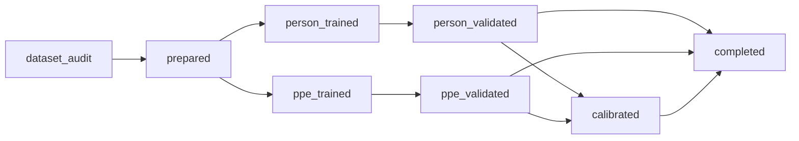

# Training a two-stage project

## Dataset contract

V0.6 accepts Pascal VOC XML with this layout:

```text
dataset/
├── images/
├── annotations/   # labels/ is also accepted for XML
└── classes.txt    # optional; XML object names are authoritative
```

Images and XML files pair by stem. The audit reports counts, missing pairs, class distribution, invalid boxes, negative images, and image/XML dimension mismatches. Training stops if the requested parent class or any explicitly selected child class has no usable annotation. Low counts and severe imbalance produce warnings without dropping classes.

## Split and crop behavior

Source images are deterministically split before child crops are generated. Defaults are train/validation/test `0.80/0.10/0.10` with seed `42`; crops from one source therefore cannot cross splits. Parent training keeps full images, including negatives. Each valid parent box produces a padded child crop, including useful negative crops.

Child objects are assigned to the parent crop with maximum intersection-over-child-area when that value is at least `0.50` by default. Boxes are clipped and converted into crop-relative YOLO coordinates. Selected child names receive contiguous IDs in the provided order.

## API and configuration

Use `TrainingConfig` with `train_two_stage`, or `two-stage-ppe train --help`. The focused controls cover base checkpoints, epochs, image size, independent batch sizes, device, seed, padding, IoA threshold, split ratios, patience, and workers. Advanced Ultralytics configuration remains available by using Ultralytics directly.

`--dry-run` audits and returns the resolved class/split plan without creating the output project or calling a trainer. `--prepare-only` creates both datasets and manifests but does not initialize Ultralytics training.

## Generated project

```text
runs/my_project/
├── data/
│   ├── parent_dataset/
│   ├── child_dataset/
│   └── splits.json
├── weights/
│   ├── person_best.pt
│   └── ppe_best.pt
├── metrics/
├── logs/
├── project.json
└── training_summary.json
```

Ultralytics progress remains visible and its run artifacts live under `logs/`. Project metadata is updated after preparation and after each completed stage. If later training or validation fails, existing artifacts are retained and the manifest records the failing stage, exception type, and message.

## State lifecycle and resume



Pass `resume=True` to `train_two_stage`, or `--resume` on the CLI. The planner compares schema-v2 fingerprints and verifies dataset manifests/YAML files, non-empty checkpoints, validation metadata, and calibration output rather than trusting status alone. A completed compatible project is idempotent and makes no trainer calls. Failed stages are never marked complete; a later resume keeps compatible artifacts, reruns the incomplete stage, and clears the failure after success.

Configuration is fingerprinted by dependency group. Changing person epochs reruns person training/validation but can reuse PPE training. Changing child classes, crop padding, IoA, split settings, or source data regenerates preparation and reruns affected PPE work. Calibration candidate changes rerun calibration without retraining either model. The source fingerprint hashes annotation content and records relative paths, sizes, and modification times; image bytes are not hashed, which keeps scans practical but means a same-size image rewritten while preserving its timestamp may not be detected.

Use `--resume --dry-run` to return a read-only `reuse`/`run` plan. Use `--resume --restart-from ppe_train` (or another canonical/CLI stage name) to invalidate that point and downstream work. Resume is project-stage recovery, not Ultralytics optimizer/epoch continuation.

Schema-v1 (v0.5) manifests remain supported by `PPEPipeline.from_project()`. Because they lack fingerprints, training resume conservatively rebuilds rather than blindly trusting their artifacts. New incomplete manifests produce a clear project-state error during pipeline loading.

## Calibration

Optional calibration uses only original validation images and annotations. Low-threshold cascade predictions are cached once, then a moderate confidence grid is evaluated with one-to-one IoU matching and P/R/F1. The selected thresholds are written to the project manifest. Without calibration, documented defaults of `0.25/0.25` are used; they are not presented as optimized values.

## Loading and hardware

`PPEPipeline.from_project("runs/my_project/project.json")` resolves relative checkpoints, the parent class, crop padding, IoU, and selected/default confidence values. Training resources and accuracy depend on the supplied data, models, and hardware. Reduce person/PPE batch sizes when accelerator memory is constrained.
